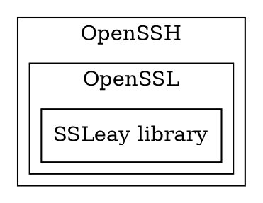

[TOC]

# 1. OpenSSH 是什么？

>[OpenSSH](https://www.openssh.com) is the premier connectivity **tool** for remote login with the SSH protocol

OpenSSH 是安全 Shell (SSH) 工具的开放源代码版本，是一个软件。
Linux 及其他非 Windows 系统的管理员使用此类工具跨平台管理远程系统。


官网:https://www.openssh.com/
Github:https://github.com/PowerShell/openssh-portable/tree/v8.1.0.0

## 1.1. 特色与组成

SSH 基于客户端-服务器体系结构，用户在其中工作的系统是客户端，所管理的远程系统是服务器。 OpenSSH 包含一系列组件和工具，用于提供一种安全且简单的远程系统管理方法，其中包括：
1. `sshd`，它是远程所管理的系统上必须运行的 SSH 服务器组件
2. `ssh`，它是在用户的本地系统上运行的 SSH 客户端组件
3. `sftp`，这是提供安全文件传输协议的服务，通过 SSH 运行
4. `scp` ，是在 SSH 上运行的文件复制实用工具
5. `ssh-keygen`，为 SSH 生成、管理和转换身份验证密钥
6. `ssh-agent`，存储用于公钥身份验证的私钥
7. `ssh-add`，将私钥添加到服务器允许的列表中
8. `ssh-keyscan`，帮助从许多主机收集公用 SSH 主机密钥

## 1.2. SSH协议

SSH是一种网络协议
Secure Shell（安全外壳协议，简称SSH）是一种加密的网络传输协议，可在不安全的网络中为网络服务提供安全的传输环境。


SSH协议框架中最主要的部分是三个协议：

1. `传输层协议（The Transport Layer Protocol）`：传输层协议提供服务器认证，数据机密性，信息完整性等的支持。
2. `用户认证协议（The User Authentication Protocol）`：用户认证协议为服务器提供客户端的身份鉴别。
3. `连接协议（The Connection Protocol）`：连接协议将加密的信息隧道复用成若干个逻辑通道，提供给更高层的应用协议使用。

同时还有为许多高层的网络安全应用协议提供扩展的支持。
各种高层应用协议可以相对地独立于SSH基本体系之外，并依靠这个基本框架，通过连接协议使用SSH的安全机制。

## 1.3. ssh和ssl的联系和区别

ssh：Secure Shell，安全Shell，是一个软件，处于应用层旨在取代明文通信的telnet；对应的开源实现程序是openssh。 

ssl：Secure Sockets Layer，安全套接字层，是一个协议，处于传输层之上应用层之下用于协商密钥；对应的开源实现库是openssl。

简写|全称|译名|身份|所处层|目的|加密算法|开源实现
--|--|--|--|--|--|--|--|
ssh|Secure Shell|安全shell|应用|应用层|取代telnet|RSA|openssh
ssl|Secure Sockets Layer|安全套接字层|协议|传输层之上应用层之下|协商密钥|协商得到对称密钥|openssl

# 2. 安装
## 2.1. Linux
## 2.2. Windwows
参考 [微软：安装适用于 Windows Server 2019 和 Windows 10 的 OpenSSH](https://docs.microsoft.com/zh-cn/windows-server/administration/openssh/openssh_install_firstuse)


# 3. OpenSSH实践

## 3.1. sshd

## 3.2. ssh

```shell
ssh username@servername 22 
```


### 3.2.1. ssh 掉线的问题

```shell
vim /etc/ssh/sshd_config

>>>
# 找到ClientAliveInterval和ClientAliveCountMax ，去掉注释并修改
ClientAliveInterval 30
ClientAliveCountMax 86400

service sshd restart
```
## 3.3. ssh-keygen--用于生成安全的密钥


## 3.4. scp

scp都是在本地操作,因此需要指明远端的信息,其实scp本质上也是基于ssh的,因此同样使用-i指定公钥.

需要注意的是scp有如下使用限制:
1. 如果远程服务器防火墙有为scp命令设置了指定的端口，我们需要使用-P参数来设置命令的端口号
2. 使用scp命令要确保使用的用户具有可读取远程服务器相应文件的权限，否则scp命令是无法起作用的。
用法:

### 复制:本地-->远端

**复制文件**
```shell
# 复制文件
scp <local_file> remote_username@remote_ip:remote_folder
scp <local_file> remote_username@remote_ip:remote_file
scp <local_file> remote_ip:remote_folder
scp <local_file> remote_ip:remote_file
scp <local_file> host_alias:remote_folder
scp <local_file> host_alias:remote_file
```
第1,2个指定了用户名，命令执行后需要再输入密码，第1个仅指定了远程的目录，文件名字不变，第2个指定了文件名

第3,4个没有指定用户名，命令执行后需要输入用户名和密码，第3个仅指定了远程的目录，文件名字不变，第4个指定了文件名

第5,6个使用了ssh中设置的连接别名.

**复制文件夹**
```shell
# 复制文件夹
scp -r local_folder remote_username@remote_ip:remote_folder
scp -r local_folder remote_ip:remote_folder
scp -r local_folder host_alias:remote_folder
```

第1个指定了用户名，命令执行后需要再输入密码
第2个没有指定用户名，命令执行后需要输入用户名和密码
第3个使用了ssh中设置的连接别名
### 复制:远程-->本地

从远程复制到本地，只要将从本地复制到远程的命令的后2个参数调换顺序即可


```shell
scp -r remote_username@remote_ip:remote_folder local_folder
```

参数说明:

-1： 强制scp命令使用协议ssh1
-2： 强制scp命令使用协议ssh2
-4： 强制scp命令只使用IPv4寻址
-6： 强制scp命令只使用IPv6寻址
-B： 使用批处理模式（传输过程中不询问传输口令或短语）
-C： 允许压缩。（将-C标志传递给ssh，从而打开压缩功能）
-p：保留原文件的修改时间，访问时间和访问权限。
-q： 不显示传输进度条。
-r： 递归复制整个目录。
-v：详细方式显示输出。scp和ssh(1)会显示出整个过程的调试信息。这些信息用于调试连接，验证和配置问题。
-c cipher： 以cipher将数据传输进行加密，这个选项将直接传递给ssh。
-F ssh_config： 指定一个替代的ssh配置文件，此参数直接传递给ssh。
-i identity_file： 从指定文件中读取传输时使用的密钥文件，此参数直接传递给ssh。
-l limit： 限定用户所能使用的带宽，以Kbit/s为单位。
-o ssh_option： 如果习惯于使用ssh_config(5)中的参数传递方式，
-P port：注意是大写的P, port是指定数据传输用到的端口号
-S program： 指定加密传输时所使用的程序。此程序必须能够理解ssh(1)的选项。

# 4. 案例
## 4.1. 远程服务器的免密登入

将`客户端`生成的公钥写入`指定远程服务器`的**指定用户**授权清单里面

```shell
# 方案1
ssh-copy-id -i id_rsa root@172.28.44.120

# 方案2
scp id_rsa.pub root@xxx.xxx.xxx.xxx:/root
mkdir ~/.ssh                # 如果不存在该文件夹需先创建，若已存在则忽略
cat ~/id_rsa.pub >> ~/.ssh/authorized_keys
rm ~/id_rsa.pub                 # 用完就可以删掉了
```

## 4.2. gitlab

## 4.3. github 免密使用

完成ssh-agent 服务的启动和 ssh-add 的私钥添加和管理后，
开 Terminal（终端）。输入以下内容：

```shell
$ ssh -T git@github.com
# Attempts to ssh to GitHub
```
您可能会看到类似如下的警告：
```shell
> The authenticity of host 'github.com (IP ADDRESS)' can't be established.
> RSA key fingerprint is SHA256:nThbg6kXUpJWGl7E1IGOCspRomTxdCARLviKw6E5SY8.
> Are you sure you want to continue connecting (yes/no)?
Verify that the fingerprint in the message you see matches GitHub's RSA public key fingerprint. If it does, then type yes:

> Hi username! You've successfully authenticated, but GitHub does not
> provide shell access.
```

您可能会看到以下错误消息：


```shell
...
Agent admitted failure to sign using the key.
debug1: No more authentication methods to try.
Permission denied (publickey).
```
这是某些 Linux 发行版的已知问题。 更多信息请参阅“错误：代理承认没有签署”。

验证生成的消息包含您的用户名。 如果收到“权限被拒绝”消息，请参阅“错误：权限被拒绝（公钥）”。


# 5. 参考资料

https://docs.microsoft.com/zh-cn/windows-server/administration/openssh/openssh_install_firstuse


[Github官网：使用 SSH 连接到 GitHub](https://docs.github.com/cn/free-pro-team@latest/github/authenticating-to-github/testing-your-ssh-connection)