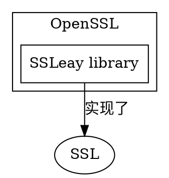

[TOC]

# 1. SSL 协议

Secure Sockets Layer (SSL) protocol

# 2. 什么是 OpenSSL

>[OpenSSL](https://github.com/openssl/openssl) is a robust, commercial-grade, full-featured Open Source **Toolkit** for the Transport Layer Security (TLS) protocol formerly known as the Secure Sockets Layer (SSL) protocol.‘

OpenSSL 是实现SSL协议的开源工具包

## 2.1. OpenSSL的组成

openssl 其实包括三部分：
1. SSL协议库
2. 应用程序（openssl可执行程序）
3. 密码算法库（包括各类主流加密算法）

