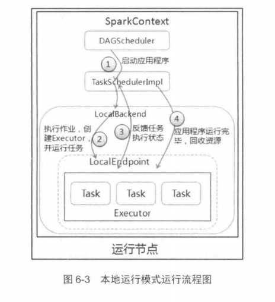
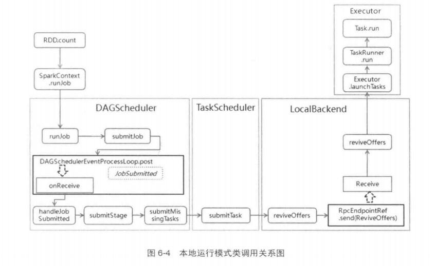

[TOC]
# 概述
Local模式（单机模式）中，Spark 的所有进程在一台机器的JVM。该模式一般适用于测试环境。 



# 安装

## 1.1. spark on google colab

```shell
!apt install openjdk-8-jdk-headless
!wget -q https://www-us.apache.org/dist/spark/spark-2.4.3/spark-2.4.3-bin-hadoop2.7.tgz
!tar xf spark-2.4.3-bin-hadoop2.7.tgz
!pip install -q findspark
import os
os.environ["JAVA_HOME"] = "/usr/lib/jvm/java-8-openjdk-amd64"
os.environ["SPARK_HOME"] = "/content/spark-2.4.3-bin-hadoop2.7"
!update-alternatives --config java
#select openjdk1.8  enter

import findspark
findspark.init()
from pyspark.sql import SparkSession
spark = SparkSession.builder.master("local[*]").getOrCreate()
```