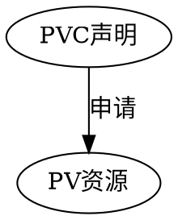

[TOC]

# 1. 卷概述

## 1.1. 为什么要由数据卷

Kubernetes Volume（数据卷）主要解决了如下两方面问题：

**数据持久性**：通常情况下，容器运行起来之后，写入到其文件系统的文件暂时性的。当容器崩溃后，kubelet 将会重启该容器，此时原容器运行后写入的文件将丢失，因为容器将重新从镜像创建。
**数据共享**：同一个 Pod（容器组）中运行的容器之间，经常会存在共享文件/文件夹的需求

```shell
Volume= 数据持久+数据共享的解决方案（存储资源）
```

## 1.2. Kubernetes支持的卷类型

Kubernetes 支持 20 种存储卷类型（可参考 Types of Persistent Volumes），如下所示：

### 1.2.1. 非持久性存储
emptyDir
HostPath (只在单节点集群上用做测试目的)
### 1.2.2. 网络连接性存储
SAN：iSCSI、ScaleIO Volumes、FC (Fibre Channel)
NFS：nfs，cfs
### 1.2.3. 分布式存储
Glusterfs
RBD (Ceph Block Device)
CephFS
Portworx Volumes
Quobyte Volumes
### 1.2.4. 云端存储
GCEPersistentDisk
AWSElasticBlockStore
AzureFile
AzureDisk
Cinder (OpenStack block storage)
VsphereVolume
StorageOS


这些数据卷可以使用 Azure 磁盘或 Azure 文件：
`Azure 磁盘` 可用于创建 Kubernetes DataDisk 资源。 Azure 磁盘可以使用由高性能 SSD 支持的 Azure 高级存储，也可以使用由普通 HDD 支持 Azure 标准存储。 对于大部分生产和开发工作负荷，请使用高级存储。 Azure 磁盘以 ReadWriteOnce 的形式装载，因此仅可用于单个 Pod。 对于可同时由多个 Pod 访问的存储卷，请使用 Azure 文件存储。
`Azure 文件` 可用于将 Azure 存储帐户支持的 SMB 3.0 共享装载到 Pod。 借助 Azure 文件,可跨多个节点和 Pod 共享数据。 文件可以使用由常规 HDD 支持的 Azure 标准存储，也可以使用由高性能 SSD 支持的Azure 高级存储。

### 1.2.5. 自定义存储
FlexVolume


## 1.3. 数据卷的操作
### 1.3.1. 挂载

挂载是指将定义在 Pod 中的数据卷关联到容器

### 1.3.2. PVC声明与管理


# 2. PV 与 PVC




用于存储和检索数据的传统卷作为 Azure 存储支持的 Kubernetes 资源创建。 你可以手动创建这些数据卷并直接分配给 Pod，也可以让 Kubernetes 自动创建它们。 


## 2.1. 什么是PV

PV全称叫做 Persistent Volume，持久化存储卷，是一类存储资源。它是用来描述或者说用来定义一个存储卷的，这个通常都是有运维或者数据存储工程师来定义。
## 2.2. 什么是PVC
`PVC` 的全称是：`Persistent Volume Claim`（持久化卷声明），PVC 是用户存储的一种声明。

PVC 和 Pod 比较类似，Pod 消耗的是节点，PVC 消耗的是 PV 资源，Pod 可以请求 CPU 和内存，而 PVC 可以请求特定的存储空间和访问模式。对于真正使用存储的用户不需要关心底层的存储实现细节，只需要直接使用 PVC 即可。

## 2.3. PV 与PVC 如何绑定


# 3. 使用
## 3.1. NFS
### 3.1.1. 准备工作--安装nfs
在使用 PVC 之前，我们还得把**所有节点**上的 nfs 客户端给安装上，比如我们这里：

安装命令如下：

```shell
# CentOS
yum -y install  nfs-utils rpcbind

#Ubuntu
sudo apt update
sudo apt install nfs-kernel-server
```

### 3.1.2. 新建 PVC
同样的，我们来新建一个数据卷声明，来请求 1Gi 的存储容量，访问模式也是 ReadWriteOnce，YAML 文件如下：
```shell
cat << EOF > pvc-nfs.yaml
apiVersion: v1
kind: PersistentVolumeClaim
metadata:
  name: pvc-nfs
spec:
  accessModes:
  - ReadWriteOnce
  resources:
    requests:
      storage: 1Gi
EOF
```
可以看到这里的声明方法几乎和新建 PV 是一样的，在新建 PVC 之前，可以看下之前创建的 PV 的状态：

```shell
kubectl get pv
>>>
NAME      CAPACITY   ACCESS MODES   RECLAIM POLICY   STATUS      CLAIM               STORAGECLASS   REASON    AGE
pv-nfs    1Gi        RWO            Recycle          Available                                                19m
```

可以看到当前 pv-nfs 是在 Available 的一个状态，所以这个时候 PVC 可以和这个 PV 进行绑定：

```shell
kubectl create -f pvc-nfs.yaml
persistentvolumeclaim "pvc-nfs" created

kubectl get pvc
NAME        STATUS    VOLUME    CAPACITY   ACCESS MODES   STORAGECLASS   AGE
pvc-nfs     Bound     pv-nfs    1Gi        RWO                          12s
```

可以看到 pvc-nfs 创建成功了，状态是 Bound 状态了，这个时候再看下 PV 的状态呢：

```shell
$ kubectl get pv
NAME      CAPACITY   ACCESS MODES   RECLAIM POLICY   STATUS    CLAIM               STORAGECLASS   REASON    AGE
pv-nfs    1Gi        RWO            Recycle          Bound     default/pvc-nfs                                                                                       23m
```
可以看到 PV 也是 Bound 状态了，对应的声明是 default/pvc-nfs，就是 default 命名空间下面的 pvc-nfs，证明刚刚新建的 pvc-nfs 和 pv-nfs 绑定成功了。


**提问**：并没有在 pvc-nfs 中指定关于 pv 的什么标志，它们之间是怎么就关联起来了的呢？

**解答**：其实这是系统自动帮我们去匹配的，它会根据我们的声明要求去查找处于 Available 状态的 PV，如果没有找到的话那么PVC 就会一直处于 Pending 状态，找到了的话当然就会把当前的 PVC 和目标 PV 进行绑定，这个时候状态就会变成 Bound 状态了。

### 3.1.3. 使用 PVC
使用之前的 nginx 的镜像来测试下：(nfs-pvc-deploy.yaml)
```yml
apiVersion: apps/v1beta1
kind: Deployment
metadata:
  name: nfs-pvc
spec:
  replicas: 3
  template:
    metadata:
      labels:
        app: nfs-pvc
    spec:
      containers:
      - name: nginx
        image: nginx:1.7.9
        imagePullPolicy: IfNotPresent
        ports:
        - containerPort: 80
          name: web
        volumeMounts:                        #挂载容器中的目录到pvc nfs中的目录
        - name: www
          mountPath: /usr/share/nginx/html
      volumes:
      - name: www
        persistentVolumeClaim:              #指定pvc
          claimName: pvc-nfs

---
apiVersion: v1
kind: Service
metadata:
  name: nfs-pvc
  labels:
    app: nfs-pvc
spec:
  type: NodePort
  ports:
  - port: 80
    targetPort: web              #容器端口或名字
  selector:
    app: nfs-pvc
```
这里使用 nginx 镜像，将容器的 `/usr/share/nginx/html` 目录通过 volume 挂载到名为 pvc-nfs 的 PVC 上面，然后创建一个 NodePort 类型的 Service 来暴露服务：

```shell
kubectl create -f nfs-pvc-deploy.
>>>
deployment.extensions "nfs-pvc" created
service "nfs-pvc" created
...
kubectl get pods
>>>
NAME                                             READY     STATUS     RESTARTS   AGE
...
nfs-pvc-57c9945bd9-5r4r6                         1/1       Running    0          19s
nfs-pvc-57c9945bd9-gz6p9                         1/1       Running    0          19s
nfs-pvc-57c9945bd9-x6mvc                         1/1       Running    0          19s
...

kubectl get svc
>>>

NAME         TYPE        CLUSTER-IP      EXTERNAL-IP   PORT(S)        AGE
...
nfs-pvc      NodePort    10.98.246.155   <none>        80:30769/TCP   1m
...
```
然后就可以通过任意节点的 IP:30769 端口来访问这里的 Nginx 服务了，但是这个时候访问会出现403，这是为什么？我们再去看看 nfs 共享数据目录下面有没有数据呢？


```shell
image.png
$ ls /data/k8s
```
发现并没有任何数据，这是因为我们把容器目录/user/share/nginx/html和挂载到了pvc-nfs这个 PVC 上面，这个 PVC 就是对应着我们上面的 nfs 的共享数据目录的，该目录下面还没有任何数据，所以我们访问就出现了403，现在我们在/data/k8s这个目录下面新建一个 index.html 的文件：

```shell
$ echo "<h1>Hello Kubernetes~</h1>" >> /data/k8s/index.html
$ ls /data/k8s/
index.html
```
可以看到共享数据目录中已经有一个 index.html 的文件了，由于我们挂载了 pvc2-nfs 到上面的 nginx 容器中去，是不是这个时候容器目录/user/share/nginx/html下面也有index.html这个文件了啊？所以这个时候我们再来访问下服务，任一节点IP:30769：
image.png
现在是不是正常了啊，但是我们可以看到我们容器中的数据是直接放到共享数据目录根目录下面的，如果以后有一个新的 nginx 容器也做了数据目录的挂载，会发生冲突，所以这个时候就不太好区分了，可以在 Pod 中使用一个新的属性：subPath，该属性可以来解决这个问题，只需要更改上面的 Pod 的 YAML 文件即可：

创建pvc子目录
```yml
volumeMounts:
- name: www
  subPath: nginxpvc-test
  mountPath: /usr/share/nginx/html
```
更改完 YAML 文件后，我们重新更新即可：

```shell
$ kubectl apply -f nfs-pvc-deploy.yaml
>>>
Warning: kubectl apply should be used on resource created by either kubectl create --save-config or kubectl apply
deployment.extensions "nfs-pvc" configured
Warning: kubectl apply should be used on resource created by either kubectl create --save-config or kubectl apply
service "nfs-pvc" configured
```

更新完后，我们再去看看 nfs 的数据共享目录：

```shell
$ ls /data/k8s/
index.html  nginxpvc-test
$ ls /data/k8s/nginxpvc-test/
```

## 3.2. Azure file

1. 创建密钥
```shell
kubectl create secret generic azure-storage-secret --from-literal=azurestorageaccountname=[account name] --from-literal=azurestorageaccountkey=[account key]

```


```shell
# 注意base64
cat << EOF > AzureSecret.yaml
kind: StorageClass
apiVersion: v1
kind: Secret
metadata:
  name: storage-secret
type: Opaque
data:
  azurestorageaccountname: [base64 account name]
  azurestorageaccountkey: [base64 account key]
EOF
kubectl apply -f AzureSecret.yaml
```

```shell
cat << EOF > httpd.yaml
apiVersion: apps/v1beta1
kind: Deployment
metadata:
  name: webfile
spec:
  replicas: 1
  template:
    metadata:
      labels:
        app: webfile
    spec:
      containers:
      - name: webfile
        image: httpd
        imagePullPolicy: Always
        volumeMounts:
        - name: azurefileshare
          mountPath: /usr/local/apache2/htdocs/
          readOnly: true
        ports:
        - containerPort: 80
      volumes:
      - name: azurefileshare
        azureFile:
          secretName: azure-storage-secret
          shareName: test
          readOnly: false
---
apiVersion: v1
kind: Service
metadata:
  name: webfile
spec:
  type: LoadBalancer
  ports:
  - port: 80
  selector:
    app: webfile
EOF
kubectl apply -f httpd.yaml
```


```shell
kubectl get svc
```

