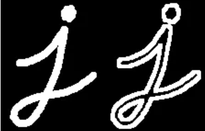

[TOC]

# 1. 形态学操作

形态学（morphology）操作主要有[^形态学操作]：


## 1.1. 定义结构元素

形态学操作选项
```python
# 形态学操作选项
foo=cv2.MORPH_RECT

type(foo)
>>>
int 
>>>foo 
0

# 矩形
cv2.MORPH_RECT
>>>0 
# 腐蚀
cv2.MORPH_ERODE
>>>0 

# 膨胀
cv2.MORPH_DILATE
>>>1
# 十字交叉形
cv2.MORPH_CROSS
>>>1

# 椭圆
cv2.MORPH_ELLIPSE
>>>2
# 开运算
cv2.MORPH_OPEN
>>>2

# 闭运算
cv2.MORPH_CLOSE
>>> 3
# 形态梯度
cv2.MORPH_GRADIENT
>>> 4
# 顶帽
cv2.MORPH_TOPHAT
>>> 5
# 黑帽
cv2.MORPH_BLACKHAT
>>> 6
```


```python
kernel=cv2.getStructuringElement(shape, ksize[, anchor])

type(kernel)
>>>
np.array
```

**参数说明** 

1. `shape` : int , 注意不是np.array 的shape，是 `MorphShapes` 之一 
   - [cv2.MORPH_CLOSE,cv2.MORPH_GRADIENT,cv2.MORPH_TOPHAT,cv2.MORPH_BLACKHAT,...]

2. `ksize` :tuple 结构体shape  (3,3)
3. `anchor` : Anchor position within the element. The default value $(-1, -1)$ means that the


**返回值**

1. `kernel`: np.array ,shape=ksize， 
    - array 数值依据 MorphShapes 确定


## 1.2. 腐蚀

```python
# 1. 获取kernel 
## 1.1 方法1
kernel = np.ones((5,5),np.uint8)

## 1.2 方法2
# kernel=cv2.getStructuringElement(shape, ksize[, anchor])

erosion = cv2.erode(img,kernel,iterations = 1)
```

**返回值**

1. `erosion`: np.array 


## 1.3. 膨胀

```python
kernel = np.ones((5,5),np.uint8)  
dilation = cv2.dilate(img,kernel,iterations = 1)
```


## 1.4. 开运算
开运算（Opening）：先腐蚀再膨胀

```python
# 开运算
kernel = np.ones((23, 23), np.uint8)
iterations = 10  # 执行开运算的次数 
opened = cv2.morphologyEx(blurred, cv2.MORPH_OPEN, kernel,iterations)

```
## 1.5. 闭运算
闭运算（Closing）： 先膨胀再腐蚀

```python
# 闭运算
kernel = cv2.getStructuringElement(cv2.MORPH_RECT,(5,5))
iterations = 10  # 执行闭操作的次数 
close_res = cv2.morphologyEx(img, cv2.MORPH_CLOSE, kernel, iterations)
```

## 1.6. 黑帽运算

```python

#设置卷积核
kernel = np.ones((5,5), np.uint8)

#图像黑帽运算
result = cv2.morphologyEx(src, cv2.MORPH_BLACKHAT, kernel)
```

## 1.7. 顶帽运算

```python

#设置卷积核
kernel = np.ones((5,5), np.uint8)

#顶帽运算
result = cv2.morphologyEx(src, cv2.MORPH_TOPHAT, kernel)
```


## 1.8. 形态梯度

这个和腐蚀以及膨胀不同，结果看上去像是物体的轮廓。

```python
gradient = cv2.morphologyEx(img,cv2.MORPH_GRADIENT,kernel)
```



