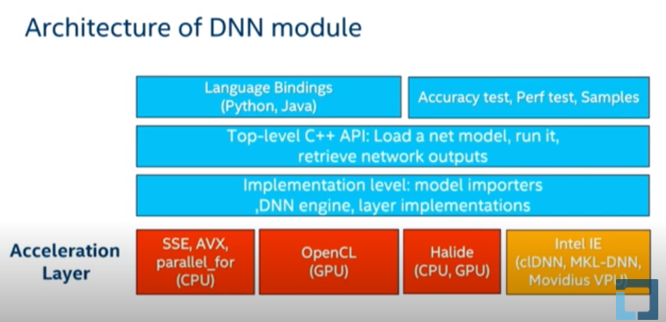

[TOC]

OpenCV 的DNN module 只能用于推理阶段。

# 优势

1. 轻量级
2. 方便
3. 通用
   - 适用于CPU/GPU 设备
   - 适用于Android、Linux、Win、Mac 系统 

# 架构与机理



# 1. 基本步骤
## 1.1. 加载模型


因为OpenCV只支持推理，所以首先你需要有一个训练好的模型。OpenCV支持所有主流框架的大部分模型。从OpenCV的readNet系列函数就可以看出来：

```python
net=cv2.dnn.readNetFromCaffe()
net=cv2.dnn.readNetFromTensorflow()
net=cv2.dnn.readNetFromTorch()
net=cv2.dnn.readNetFromDarknet()
net=cv2.dnn.readNetFromONNX()
net=cv2.dnn.readNetFromModelOptimizer()
```
## 1.2. 图像预处理

在OpenCV中，输入给模型的图像需要首先被构建成一个4维的Blob，看到Blob这个词感觉是收到了Caffe的影响。在构建Blob的时候会做一些诸如resize、归一化和缩放之类的简单预处理。OpenCV提供的函数为:

```python

blob=cv2.dnn.blobFromImage(image, scalefactor=None, size=None, mean=None, swapRB=None, crop=None, ddepth=None)

type(blob)
>>> 
np.array


blob.shape
>>>
(1,w,h,4)
```

这个函数在构建Blob的之前会先做如下计算：

1. (image - mean) * scalefactor。

```
# 功能差不多
blob=cv2.dnn.blobFromImages(
    image, scalefactor=1.0, size, mean, swapRB=True,crop=False,ddepth = CV_32F )
```


**参数说明**
1. `image` :这是传入的，需要进行处理的图像。
2. `scalefactor`: 执行完减均值后，需要缩放图像，默认是1，需要注意，$scalefactor = \frac{1}{\sigma}1 / $,这是真正乘上的值。 

3. `size`,这是神经网络，真正支持输入的值。

4. `mean`, 这是我们要减去的均值，可以是R,G,B均值三元组，或者是一个值，每个通道都减这值。如果执行减均值，通道顺序是RGB。 如果，输入图像通道顺序是BGR，那么请确保`swapRB = True`，交换通道。

5. `swapRB`, swap Blue and Red channels
   - 干的是`cv2.cvtColor(image, cv2.COLOR_BGR2RGB)`的事情。
   - OpenCV认为图像通道顺序是BGR，而减均值时顺序是RGB，为了解决这个矛盾，设置swapRB=True即可。
6. `crop`
   - 如果`crop==True`，则调整输入图像的大小，使调整大小后的一侧等于相应的尺寸，另一侧等于或大于。然后，从中心进行裁剪。
   - 如果`crop==False`，则直接调整大小而不进行裁剪并保留纵横比。
7. `ddepth`, 输出blob的深度，选则`cv2.CV_32F` or `cv2.CV_8U`。


## 1.3. 模型推理

模型推理过程就是神经网络模型进行一次前向传播，在OpenCV中，用以下可读性非常强的两行代码即可完成：


```python
net.setInput(blob)
output = net.forward()
```

把第一节构建的blob输入给模型，然后执行一次前向传播。

得到输出output再做一些处理使得我们可以更好的可视化图像