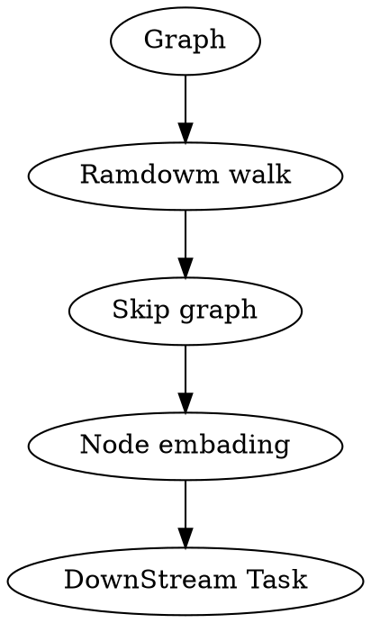

[TOC]

# 1. 图游走类算法
DeepWalk、word2vec、node2vec


## 1.1. npl背景

### 1.1.1. word2vec

#### 1.1.1.1. Skip Gram
#### 1.1.1.2. CBOW

## 1.2. 同构图

### 1.2.1. DeepWalk

算法流程： 【其中使用skip-gram模型是为了利用梯度的方法对参数进行更新训练】





#### 1.2.1.1. A.随机游走


从今天的课堂上,我们知道, 对于给定的节点，DeepWalk会等概率的选取下一个相邻节点加入路径，直至达到最大路径长度，或者没有下一个节点可选。


因此, 假如我们想要得到一条walk, 我们需要输入一个graph, 起始节点ID, 游走的深度walk_len。

##### 1.2.1.1.1. 优劣势

随机的深度优先搜索

#### 1.2.1.2. B.Skip Gram

#### 1.2.1.3. C.负采样


### 1.2.2. node2vec
#### 1.2.2.1. A. 偏执随机游走 

bias ramdom walk


```python
def node2vec_sample(succ, prev_succ, prev_node, p, q):

    """
    输入：succ - 当前节点的下一个相邻节点id列表 list (num_neighbors,)
        prev_succ - 前一个节点的下一个相邻节点id列表 list (num_neighbors,)
        prev_node - 前一个节点id int
        p - 控制回到上一节点的概率 float
        q - 控制偏向DFS还是BFS float
    输出：下一个节点id int
    """
    ##################################
    # 请在此实现node2vec的节点采样函数
    # 节点参数信息
    succ_len = len(succ)                # 获取相邻节点id列表节点长度（相对当前）
    prev_succ_len = len(prev_succ)      # 获取相邻节点id列表节点长度（相对前一个节点）
    prev_succ_set = np.asarray([])   # 前一节点的相邻节点id列表

    for i in range(prev_succ_len):     # 遍历得到前一节点的相邻节点id列表的新list——prev_succ_set，用于后边概率的讨论
        # 将前一节点list，依次押入新的list中
        prev_succ_set = np.append(prev_succ_set,prev_succ[i])  # ? prev_succ_set.insert(prev_succ[i])
    
    # 概率参数信息
    probs = []     # 保存每一个待前往的概率
    prob = 0   # 记录当前讨论的节点概率
    prob_sum = 0.  # 所有待前往的节点的概率之和

    # 遍历当前节点的相邻节点
    for i in range(succ_len):    # 遍历每一个当前节点前往的概率
        if succ[i] == prev_node:  # case 1 ： 采样节点与前一节点一致，那么概率为--1/q（原地）
            prob = 1. / p
        # case 2 完整的应该是： np.where(prev_succ_set==succ[i]) and np.where(succ==succ[i])
        # 但是因为succ本身就是采样集，所以np.where(succ==succ[i])总成立，故而忽略，不考虑
        elif np.where(prev_succ_set==succ[i]):   # case 2  ： 采样节点在前一节点list内，那么概率为--1   ?cpython中的代码： prev_succ_set.find(succ[i]) != prev_succ_set.end()
            prob = 1.
        elif np.where(prev_succ_set!=succ[i]):   # case 3  ： 采样节点不在前一节点list内，那么概率为--1/q
            prob = 1. / q
        else:
            prob = 0.       # case 4 ： other

        probs.append(prob)  # 将待前往的每一个节点的概率押入保存
        prob_sum += prob    # 计算所有节点的概率之和
    
    RAND_MAX = 65535   # 这是一个随机数的最值，用于计算随机值的--根据C/C++标准，最小在30000+，这里取2^16次方
    rand_num = float(np.random.randint(0, RAND_MAX+1)) / RAND_MAX * prob_sum  # 计算一个随机概率:0~prob_sum. ?cpython中的代码: float(rand())/RAND_MAX * prob_sum

    sampled_succ = 0.   # 当前节点的相邻节点中确定的采样点

    # rand_num => 是0~prob_num的一个值，表示我们的截取概率阈值--即当遍历了n个节点时，若已遍历的节点的概率之和已经超过了rand_num
    # 我们取刚好满足已遍历的节点的概率之和已经超过了rand_num的最近一个节点作为我们的采样节点
    # 比如: 遍历到第5个节点时，权重概率和大于等于rand_num,此时第5个节点就是对应的采样的节点了
    # 为了方便实现：这里利用循环递减--判断条件就变成了————当rand_num减到<=0时，开始采样节点
    for i in range(succ_len):   # 遍历当前节点的所有相邻节点
        rand_num -= probs[i]    # 利用rand_num这个随机获得的概率值作为依据，进行一个循环概率检验
        if rand_num <= 0:   # 当遇到第一次使得rand_num减到<=0后，说明到这个节点为止, 遍历应该终止了，此时的节点即未所求的节点，【停止检验条件】
            sampled_succ = succ[i]   # 并把当前节点作为确定的节点
            return sampled_succ   # 返回待采样的节点--节点一定在succ中

```


### 1.2.3. 特点

不考虑节点类型的异构随机游走，缺点
1. 偏向于出现频率高的节点类型
2. 偏向于相对集中的节点(即度数高的节点)

## 1.3. 异构图
$$G=(V,E,T)$$


### 1.3.1. Metapath2Vec
metapath2vec: Scalable Representation Learning for Heterogeneous Networks
**元路径**
在图中选取的由节点类型构成的组合路径

一般元路径是对称的。
元路径的选择一般由人工（专家）选取，使得元路径有物理意义

A-P-A

负采样的时候没有考虑节点类型

### 1.3.2. multi-Metapath2Vec ++


## 1.4. 特点与优势
这类方法受限于：
1. 灵活性不足、
2. 表达能力不足
3. 工程量过大的问题，
首先就是节点编码中权重未共享，导致权重数量随着节点增多而线性增大
另外就是直接嵌入方法缺乏泛化能力，意味着无法处理动态图以及泛化到新的图
# 2. 图采样

图采样是子图采样，不是随机采样

通过对现有 GNN 模型的调研，我们抽象出三种不同的采样器，即遍历、邻域、负采样。
1. 遍历（TRAVERSE）：用于从整个分区图中，采样一批顶点或边。
2. 邻域（NEIGHBORHOOD）：将生成顶点的上下文。该顶点的上下文可以是一个或多个 hop 邻居，用于对该顶点进行编码。
3. 负采样（NEGATIV）：用于生成负样本以加速训练过程的收敛。

## 2.1. 遍历

## 2.2. 邻域


### 2.2.1. GraphSAGE
SAGE（SAmple& aggreGatE）
参考资料：http://snap.stanford.edu/graphsage/
基本步骤：
1. 邻居采样
    1阶采样、2阶采样、...
    由顶向外
2. 邻居聚会
   由外向内，消息传递
3. 节点预测

#### 2.2.1.1. 特点
**优点**
1. 减少计算量
2. 允许泛化到其他关系

### 2.2.2. PingSAGE
采样时只能选取真实的邻居节点吗
通过多次随机游走，按游走经过的频率选取邻居


## 2.3. 负采样
负采样就是给定源节点，返回和它不相连的目标节点。负采样同时支持本地和全局负采样，对于一个batch的样本要采样其负样本时，可以按照一定的概率分布选择一个server，然后在该server上采样。如果选择本地负采样，则只在本机进行负采样。目前built-in的负采样算子包括以下几种：
• random：随机采样和给定源节点不相连的目的节点。
• in_degree：按照目的节点的入度分布，返回与源节点不相连的目的节点。

按照入度分布的in_degree负采样实现上采用AliasMethod[5]，会在首次采样前提前构建好Alias Table，因此采样是常数时间复杂度。此外负采样我们默认是严格负采样，但是出于性能和极端情形的考虑，我们支持用户端设置一个阈值来控制严格程度。负采样可能对算法效果也会产生很大影响，因此负采样算子如何和图划分结合，如何高效负采样，以及按何种分布负采样都是值得探索和研究的地方。
# 3. 邻居聚合
## 3.1. 评估聚合表达能力的
评估聚合表达能力的指标单射(一对一映射)
## 3.2. 常见

### 3.2.1. Mean
### 3.2.2. Max
### 3.2.3. Sum

## 3.3. GIN
基于单射的Graph Isomorphism Net (GIN)模型