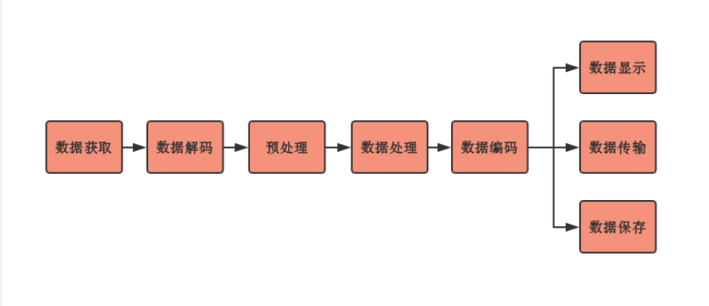

[TOC]


# 格式

什么是高效率视频编码 (HEVC)？
直到最近，H.264（也称为 AVC）还是用于优化质量和减小文件大小的首选编解码器。相较于 H.264，升级到 H.265（或 HEVC）要求更高的计算能力，但效率要高得多，并且以更低的比特率提供更好的视频质量。

HEVC/H.265 视频编解码器在 2017 年苹果全球开发者大会 (WWDC) 上达到了全球影响的临界点，苹果公司宣布 HEVC 编解码器为“下一代视频编解码器”。 由于对 HEVC 的承诺，并且大多数移动芯片组中的硬件在发布时已经支持 HEVC 视频编码，视频提供商了解到，HEVC 编解码器已成为流视频的新视频压缩标准。
HEVC 与AVC 的对比：HEVC 编解码器的优势是什么？
来自苹果公司的公告：“就一个词：效率。主要是编码效率。HEVC 比 AVC 的效率大约高出 40%。这就意味着，您的用户将会看到启动速度有 40% 的大幅提升，并且，当播放器完全适应其方式后，他们将会看到内容质量也有 40% 的提升。我们正在使得 HEVC 广泛应用。在我们最新的设备上，硬件内置了对 HEVC 的支持。即使在没有硬件支持的旧设备上，我们仍将部署软件 HEVC 编解码器。因此，HEVC 将会出现在很多不同的地方。”

每家公司的 HEVC 与 AVC 对比分析的答案可以归结为 HEVC 编解码器提供的两个基本优势：

HEVC 的效率大约是 AVC 的两倍
HEVC 支持 4K 和高动态范围
使用 HEVC 编解码器，您可以在与 AVC 相同的带宽下获得更高的视频质量，或者您可以使用 AVC 的一半带宽提供相同的质量。
HEVC 与H.264 与MPEG-2 的对比：比较三个编解码器
简而言之，HEVC 编解码器提供了用于在给定级别的视频质量下传输最少量信息所需的工具。以下是按组件比较 MPEG-2、H.264 和 HEVC 编解码器的信息。
组件	MPEG-2	H.264	HEVC/H.265
一般性问题	运动补偿预测、残差、变换、熵编码	与 MPEG-2 基本相同	与 MPEG-2 基本相同
帧内预测	仅限 DC	多方向、多模式、4x4 有 9 种帧内模式，8x8 有 9 种，16x16 有 4 种	帧内预测有 35 种模式、32x32、16x16、8x8 和 4x4 预测尺寸
编码图像类型	I、B、P	I、B、P、SI、SP	I、P、B
转换	8x8 DCT	8x8 和 4x4 类似 DCT 的整数转换	32x32、16x16、8x8 和 4x4 类似 DCT 的整数转换
运动估计块	16x16	16x16、16x8、8x16、8x8、8x4、4x8、4x4

64x64 和分层四叉树，划分为 32x32、16x16、8x8。每个尺寸最多可分为 8 种方式，不需要是正方形。
熵编码	多个 VLC 表	上下文自适应二进制算术编码 (CABAC) 和上下文自适应 VLC 表 (CAVLC)	上下文自适应二进制算术编码 (CABAC)
预测的帧距离	1 个过去和 1 个未来的参考帧	最多 16 个过去和/或未来的参考帧，包括长期参考	最多 15 个过去和/或未来的参考帧，包括长期参考
分数运动估计	½ 像素双线性插值	½ 像素 6 抽头滤波器，¼ 像素线性插值	¼ 像素 8 抽头滤波器
环路滤波器	无	自适应去块滤波器	自适应去块滤波器和采样自适应偏移滤波器
运动补偿预测、残差、变换、熵编码
运动补偿预测、残差、变换、熵编码
运动补偿预测、残差、变换、熵编码
运动补偿预测、残差、变换、熵编码
运动补偿预测、残差、变换、熵编码
多方向、多模式、4x4 有 9 种帧内模式，8x8 有 9 种，16x16 有 4 种
多方向、多模式、4x4 有 9 种帧内模式，8x8 有 9 种，16x16 有 4 种
多方向、多模式、4x4 有 9 种帧内模式，8x8 有 9 种，16x16 有 4 种
8x8 和 4x4 类似 DCT 的整数转换
16x16、16x8、8x16、8x8、8x4、4x8、4x4
16x16、16x8、8x16、8x8、8x4、4x8、4x4
多方向、多模式、4x4 有 9 种帧内模式，8x8 有 9 种，16x16 有 4 种
多方向、多模式、4x4 有 9 种帧内模式，8x8 有 9 种，16x16 有 4 种
8x8 和 4x4 类似 DCT 的整数转换
与 MPEG-2 基本相同
64x64 和分层四叉树，划分为 32x32、16x16、8x8。每个尺寸最多可分为 8 种方式，不需要是正方形。
64x64 和分层四叉树，划分为 32x32、16x16、8x8。每个尺寸最多可分为 8 种方式，不需要是正方形。
自适应去块滤波器和采样自适应偏移滤波器
自适应去块滤波器和采样自适应偏移滤波器
比较 MPEG-2 与 H.264 与HEVC 编解码器

HEVC 编解码器如何影响视频内容库？
随着媒体和娱乐公司以越来越快的速度策划和构建大型内容库，HEVC 编解码器可以节省大量的比特率。随着组织努力跟上多屏幕消费者需求，组织面临着越来越大的存储基础设施压力。使用 HEVC 编解码器将文件大小减半，可以节省存储成本，而不必将存储容量增加一倍。
HEVC 编解码器提供哪些比特率优势？
在一些情况下，HEVC 提高的质量/比特率之比将对行业产生影响。由于高质量视频分发消耗了巨大的网络容量，这些效率提升的优势包括：

通过卫星、有线和 IPTV 网络部署更多频道
托管和非托管视频分发的成本均降低
受带宽限制的移动和 IPTV 运营商的覆盖范围扩大
提高 OTT 服务的体验质量，与传统广播传输相匹配
HEVC 编解码器如何改进移动流媒体、超高清 4K 和 8K？
在移动流媒体市场中，HEVC 编解码器以低于 H.264 标准 30-50% 的比特率实现与之相当的质量，进而节省网络中视频传输的成本。

假设给定的设备可以解码 HEVC，移动运营商不需要在给定的质量级别下传输同样多的数据，从而降低成本并实现更可靠的视频播放。

HEVC 还与主流市场中高分辨率超高清 4K 和 8K 视频齐头并进，因为只有 HEVC 和更新的编解码器得到 4K 电视的广泛支持。

需要记住的主要内容是：一般来说，HEVC 应该以大约一半的数据速率传输与 H.264 相同质量的视频，但速率会因内容类型而有所不同。

例如，对于 1080p 流媒体，发布者可能将数据速率从 8Mbps 降低到 4Mbps，而不会降低质量。这种比特率的降低会对边缘缓存成本产生重大影响，因为当视频被传送给最终用户时，文件大小会变小。

在某些场景中，例如通过 4G 传送到高分辨率平板电脑，这可能允许观看者观看 1080p 流媒体而不是 720p 流媒体，从而提高观看体验的整体质量。

使用机顶盒基础设施的付费电视和有线电视公司可以使用 HEVC 吗？
对于使用传统基础设施（例如无法升级的旧式机顶盒）的付费电视和有线电视，实施 HEVC 是一项挑战。然而，其中一些公司将其内容交付分成两部分，而对于其业务的 OTT 部分，HEVC 解决方案更容易创建和实施。
我可以在多比特率流媒体中混合使用 H.264 和 HEVC 编解码器吗？
这个问题的答案很大程度上取决于观看设备在传输途中从 H.264 无缝切换到 H.265 的能力。在 HEVC 编解码器采用的早期，大多数设备选择了一种或另一种，并且在相同的多比特率流媒体中没有太多设备混合使用 H.264 和 H.265。但是，因为 H.264 和 H.265 都适用于相同的传输机制，所以混合这两种编解码器的任何困难都不是问题。
HEVC 编解码器何时成为标准的？
与 H.264 标准一样，HEVC 也是 ITU-T 视频编码专家组和 ISO/IEC 运动图像专家组 (MPEG) 共同努力的成果，他们在 2013 年建立了 HEVC 编解码器标准的第一个版本。

ITU-T 推动电信标准的制定和采用，而 ISO/IEC 管理电子行业的标准。

HEVC 编解码器的目的是为了促进视频压缩，我们可以将其优势总结为以下四点：
与 H.264 相比，固定视频质量的比特率平均降低了 50%
以相同的比特率提供更高质量的视频
定义标准语法以简化实现并最大限度地提高互操作性
保持网络友好，即打包在 MPEG 传输流中

# 编码器 encoders

编码器（encoders），或者称为编解码器（Video Codec），是实现某种编码格式的库**文件**。

只有安装了某种格式的编码器，才能实现该格式视频/音频的编码和解码。

 
## 视频编码器

FFmpeg 内置的视频编码器：
1. libx264： 最流行的开源 H.264 编码器
2. NVENC： 基于 NVIDIA GPU 的 H.264 编码器
3. libx265： 开源的 HEVC 编码器
4. libvpx： 谷歌的 VP8 和 VP9 编码器
5. libaom： AV1 编码器
等

### h264

name|描述|性能
--|--|--|
h264_nvenc |NVIDIA NVENC H.264 encoder (codec h264)基于 NVIDIA GPU 的 H.264 编码器work with windows and linux|
h264_omx|OpenMAX IL H.264 video encoder (codec h264) 树莓派raspberry pi encoder |
h264_v4l2m2m|V4L2 mem2mem H.264 encoder wrapper (codec h264) 利用use V4L2 Linux kernel内核|
h264_vaapi|H.264/AVC (VAAPI) (codec h264)vaapi 支持的硬件加速|
h264_amf|access AMD gpu, (windows only)
h264_qsv |use Intel Quick Sync Video (hardware embedded in modern Intel CPU)|
h264_videotoolbox| use videotoolbox an API to access hardware on OS X|
## 音频编码器

libfdk-aac
aac

# 1. 解码技术

关于视频软解码的资料网上比较多了，但是关于硬解可供参考的资料非常有限，虽然总得来说软解和硬解的基本逻辑一样，但是实现细节上的差别还是比较多的。


Hardware won’t accelerate demuxing and remuxing, only decode or operations on the video itself. With the ffmpeg example above you are using the copy codec which simply copies the stream without touching it’s contents. That will run well on anything. I use it on a pi zero to stream video and it uses <10% cpu.

I’m not a gstreamer expert so I can’t say for certain what’s wrong with your above example, but I don’t think those queues are necessary in that context. Removing them could possibly reduce cpu usage. Flvmux could also be the culprit. “Streamable” might be doing some surgery on the stream you don’t need (or you might, again, not a gstreamer expert).

As I understand it, only the gstreamer components starting with ‘nv’ are hardware accelerated (or omx). Muxing and demuxing in general cannot be hardware accelerated. You’re just taking a stream out of one container and putting it in another. If gstreamer is bad at that even after troubleshooting, in your case you might be better off using ffmpeg. If you don’t need video hardware, as in your simple example, you might as well.


## 1.1. 软解与硬解的区别


硬解软编:   read(ffmpeg) ---> decoder(NVIDIA) ---> |  Queue(20)  | ---> encoder(ffmpeg)
软解软编:   read(ffmpeg) ---> decoder(ffmpeg) ---> encoder(ffmpeg)

解码与编码之间维护一个队列，队列长度定为20（因为解码速度快于编码速度，数据被覆盖，丢帧）。
软解和硬解的流程
红色箭头表示需要在系统内存与显存之间进行IO，比较费时。


解码方案

- OpenCV

OpenCV封装好了cv::gpu::VideoReader_GPU类可直接进行采用GPU进行硬解，其底层实现是借助于视频解码库CUVID，CUVID是基于CUDA的视频解码库，故而只支持NVIDIA的显卡。

- Intel QSV

可以下载相应的SDK进行开发，FFmpeg的demo里有实现，现在忘光了。

- FFmpeg

FFmpeg是一套包含视音频编解码、采集、转码及处理等功能的开源库，源码由C语言编写。实现了多种标准的硬解码技术，包括Intel QSV，CUDA。

# 2. 关于硬解码的讨论
There are some features we may elect to not implement because we don’t believe they fit the PyAV ethos. The only one that we’ve encountered so far is hardware decoding. The FFmpeg man page discusses the drawback of -hwaccel:

Note that most acceleration methods are intended for playback and will not be faster than software decoding on modern CPUs. Additionally, ffmpeg will usually need to copy the decoded frames from the GPU memory into the system memory, resulting in further performance loss.

Since PyAV is not expected to be used in a high performance playback loop, we do not find the added code complexity worth the benefits of supporting this feature

# 3. 关键帧提取

```python 
# https://stackoverflow.com/questions/42798634/extracting-keyframes-python-opencv
import os
import cv2
import subprocess

filename = '/home/andriy/Downloads/video.mp4'

def get_frame_types(video_fn):
    command = 'ffprobe -v error -show_entries frame=pict_type -of default=noprint_wrappers=1'.split()
    out = subprocess.check_output(command + [video_fn]).decode()
    frame_types = out.replace('pict_type=','').split()
    return zip(range(len(frame_types)), frame_types)

def save_i_keyframes(video_fn):
    frame_types = get_frame_types(video_fn)
    i_frames = [x[0] for x in frame_types if x[1]=='I']
    if i_frames:
        basename = os.path.splitext(os.path.basename(video_fn))[0]
        cap = cv2.VideoCapture(video_fn)
        for frame_no in i_frames:
            cap.set(cv2.CAP_PROP_POS_FRAMES, frame_no)
            ret, frame = cap.read()
            outname = basename+'_i_frame_'+str(frame_no)+'.jpg'
            cv2.imwrite(outname, frame)
            print ('Saved: '+outname)
        cap.release()
    else:
        print ('No I-frames in '+video_fn)

if __name__ == '__main__':
    save_i_keyframes(filename)
```

视频分析应用
