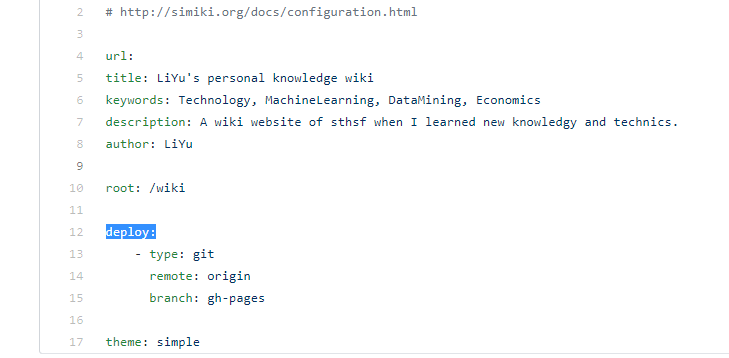

[TOC]

# 1. 共享文件系统
## 1.1. 概念

| 主要操作系统                                      | 应用层协议                        | 传输层协议                                  |
| ------------------------------------------------- | --------------------------------- | ------------------------------------------- |
| Mac OS                                            | 服务器消息块（SMB）、苹果归档协议 | TCP、UDP或AppleTalk                         |
| 类Unix系统                                        | 网络文件系统（NFS）、SMB          | TCP或UDP                                    |
| MS-DOS、Windows                                   | SMB                               | TCP、NBT（包含UDP协议）NBF或其他NetBIOS传输 |
| Novell NetWare（服务器）MS-DOS、Windows（客户端） | NCP和SAP                          | SPX（通过IPX），或TCP                       |

### 1.1.1. NFS
NFS（Network File System，网络文件系统）
NFS协议是一个建立在Sun RPC基础上的客户端/服务器应用程序，客户端通过向一台NFS服务器发送RPC请求来访问其中的文件。

### 1.1.2. SMB
SMB（Server Message Block，服务器消息块）是基于NetBIOS的一套文件共享协议，它由Microsoft公司制订，用于Lan Manager和Windows NT服务器系统中，实现不同计算机之间共享打印机、串行口和通讯抽象。

与功能类似的网络文件系统（NFS）相比，NFS的消息格式是固定长度，而CIFS的消息格式大多数是可变长度，这增加了协议的复杂性。CIFS消息一般使用NetBIOS或TCP协议发送，分别使用不同的端口139或445，当前倾向于使用445端口。CIFS的消息包括一个信头（32字节）和消息体（1个或多个，可变长）

3.Samba概述
Samba是一种开放源代码的自由软件，可以为SMB/CIFS客户提供所有方式的文件和打印服务，包括各种版本的Windows客户。

## 1.2. 与文件传输的不同

共享文件访问不应该与使用文件传输协议（FTP）、蓝牙 IRDA OBject EXchange（OBEX）协议的文件传输混淆。访问共享资源涉及到变更服务器上的文件夹时自动同步文件夹信息，并且可能提供服务器端的文件搜索，而文件传输是更基本的服务。

共享文件的访问对用户来说是透明的，就好像它是本地文件系统中的资源一样，并且支持多用户环境。这包括用户编辑远程文件时的并发控制或锁 ，以及文件系统权限。

共享文件访问通常被认为是一个本地网络（LAN）服务，而FTP是一个互联网服务。

### 1.2.1. FTP 
文件传输协议（File Transfer Protocol，FTP）
是用于在网络上进行文件传输的一套标准协议，它工作在 OSI 模型的第七层， TCP 模型的第四层， 即应用层， **使用 TCP 传输**而不是 UDP， 客户在和服务器建立连接前要经过一个“三次握手”的过程， 保证客户与服务器之间的连接是可靠的， 而且是面向连接， 为数据传输提供可靠保证。

SMB使用点对点的通讯方式，一个客户端向一个服务器提出请求，服务器相应地回答。SMB协议中的一部分专门用来处理对文件系统的访问，使得客户端可以访问一个文件服务器。SMB也有行程间通信的部分。SMB协议尤其适用于局部子网，但是也可以被用来通过万维网来链接不同的子网。Microsoft Windows的文件和打印机分享主要使用这个功能。

SMB服务器向网络上的客户端提供文件系统和其它资源。客户端计算机也可能有其自己的、不共享的硬盘，但是可能也想使用服务器上分享的文件系统和打印机。这是SMB为什么这么出名和广泛地被使用的原因。SMB普及的另一个原因是它使用适合NT网域的协议，至少提供基于NT网域式的认证。NT网域协议是一个微软远程过程调用服务，几乎只能被SMB进程间通讯的命名管道使用。几乎所有SMB服务器的实现使用NT网域来认证用户是否可以访问一个资源。

# 2. 局域网的共享文件夹设置
性能问题
一般认为SMB协议会占用很多网络带宽，因为每个客户端均在整个子网内广播其存在。但是SMB本身并不使用广播。SMB造成的广播问题实际上是NetBIOS的服务定位协议造成的。一般来说Microsoft Windows服务器使用NetBIOS来协议和定位服务。而NetBIOS则定时向一个特定的服务器广播一个服务的存在。对于一个少于20个服务器的网络来说这个方式是可行的。但是随服务器数目的增加广播造成的交通会导致问题。通过适当地实现WINS定位协议这个问题可以被缓和。WINS使用更高级的系统来确定和中央化服务需求，但是造成自己的设计和保管网络的问题。动态DNS是另一个解决方法。微软本身推荐在微软的活动目录环境下使用动态DNS。网络延迟对SMB协议的速度有非常大的冲击。在服务器之间网络延迟大的情况下通过SMB来更换文件夹非常明显地反映了这个问题。比如在通过万维网使用虚拟专用网时网络延迟就会比较大，这时使用SMB就很恼人

https://support.microsoft.com/zh-cn/help/4092694/windows-10-file-sharing-over-a-network