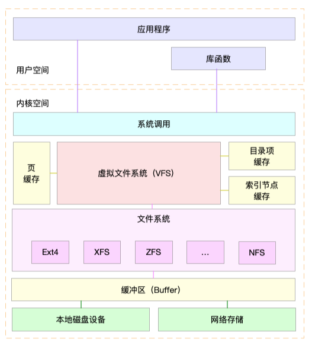
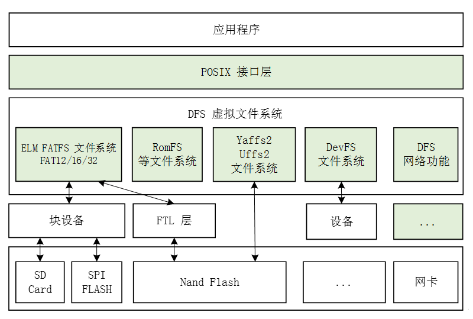

[TOC]

# 1. 分布式文件系统概述
## 1.1. 单线的文件系统
单线的文件系统  stand-alone (UNIX) file systems

### 1.1.1. 涉及概念
1. **文件**：命名的有逻辑相关的数据集合
File: named collection of logically related data

2. **Unix 文件**：未解释的字节序列
Unix file: an uninterpreted sequence of bytes

3. **文件系统**： 提供数据和存储功能的逻辑视图
File system: – Provides a logical view of data and storage functions
 – 对用户友好的界面 
 – 便于创建、修改、组织、删除文件
 – 提供共享
 – 提供保护 

 

### 1.1.2. 文件系统分类
#### 1.1.2.1. 磁盘文件系统
磁盘文件系统是一种设计用来利用数据存储设备来保存计算机文件的文件系统，最常用的数据存储设备是**磁盘驱动器**，可以直接或者间接地**连接/挂载**到计算机上。例如：FAT、exFAT、NTFS、HFS、HFS+、ext2、ext3、ext4、ODS-5、btrfs、XFS、UFS、ZFS。有些文件系统是行程文件系统（也有译作日志文件系统）或者追踪文件系统。

#### 1.1.2.2. 光盘
ISO 9660和UDF被用于CD、DVD与蓝光光盘。

#### 1.1.2.3. 闪存文件系统
闪存文件系统是一种设计用来在闪存上储存文件的文件系统。随着移动设备的普及和闪存容量的增加，这类文件系统越来越流行。

尽管磁盘文件系统也能在闪存上使用，但闪存文件系统是闪存设备的首选，理由如下：

擦除区块：闪存的区块在重新写入前必须先进行擦除。擦除区块会占用相当可观的时间。因此，在设备空闲的时候擦除未使用的区块有助于提高速度，而写入数据时也可以优先使用已经擦除的区块。
随机访问：由于在磁盘上寻址有很大的延迟，磁盘文件系统有针对寻址的优化，以尽量避免寻址。但闪存没有寻址延迟。
写入平衡（Wear levelling）：闪存中经常写入的区块往往容易损坏。闪存文件系统的设计可以使数据均匀地写到整个设备。
日志文件系统具有闪存文件系统需要的特性，这类文件系统包括JFFS2和YAFFS。也有为了避免日志频繁写入而导致闪存寿命衰减的非日志文件系统，如exFAT。

#### 1.1.2.4. 数据库文件系统
文件管理方面的一个新概念是**一种基于数据库的文件系统**的概念。不再（或者不仅仅）使用**分层结构管理**，文件按照他们的**特征进行区分**，如文件类型、专题、作者或者亚数据进行区分。于是文件检索就可以按照SQL风格甚至自然语言风格进行。

例如BFS和WinFS。

#### 1.1.2.5. 网络文件系统

网络文件系统（NFS，Network File System）是一种将远程主机上的分区（目录）经网络挂载到本地系统的一种机制

## 1.2. 分布式文件系统

分布式文件系统可以提供基于位置的寻址和冗余等功能，这些特性可以提高可靠性或降低集群其他部分的复杂性，对用户提供透明的文件服务。

分布式文件系统可以在许多方面实现"透明性"。也就是说，它们的目标是让客户机程序"看不见"它们，这些客户端程序“看到”的事一个类似于本地文件系统的系统。在幕后，分布式文件系统处理定位文件、传输数据，并可能提供下面列出的其他功能。
• 访问透明性 ：客户端感受不到文件是分布式的，并且可以像访问本地文件一样访问它们。
• 位置透明性 ：存在一致的名字空间，包含本地文件和远程文件。文件名不提供其位置。
• 并发透明性 ：所有客户端都具有相同的文件系统状态视图。这意味着，如果一个进程正在修改一个文件，那么同一系统或远程系统上访问该文件的任何其他进程都会以一致的方式看到修改。
• 失败透明性 ：客户端和客户端程序应在服务器发生故障后正常运行。
• 异构性 ：文件服务应该跨不同的硬件和操作系统平台提供。
• 可扩展性 ：文件系统应该在小型环境（1台机器，12台机器）中运行良好，并且可以优雅地扩展到更大的（数百到数万个系统）。
• 复制透明性 ：客户端不应感受到文件复制是跨多个服务器执行的。
• 迁移透明度 ：文件在不同的服务器之间的移动不应该让客户感受到。

### 1.2.1. 常见的分布式文件系统有
1	Google 的GFS Google file  System
2 	Hadoop 的HDFS
3	加州大学圣克鲁克 Ceph
4	GlusterFS （红帽）

**Q:** 放在两台可以上网的电脑的文件，叫分布式文件系统吗？
**A:** 不叫，外部不可以从一个地址寻找文件。需要基于位置的寻址，或者说没有元数据

MetaData 元数据：描述数据的数据，主要是描述数据的属性信息，包括数据存储位置、历史数据描述、资料查找、文件记录
