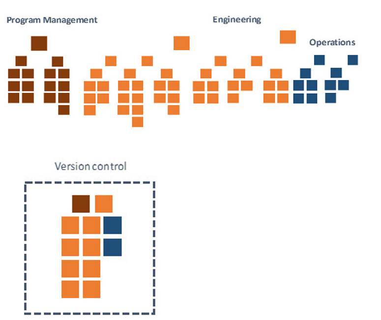
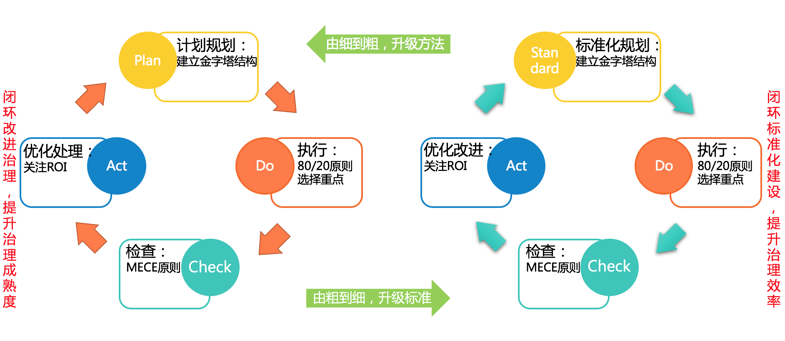
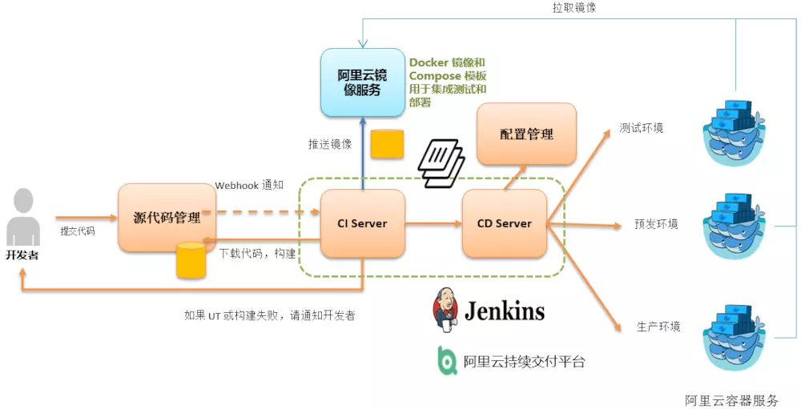
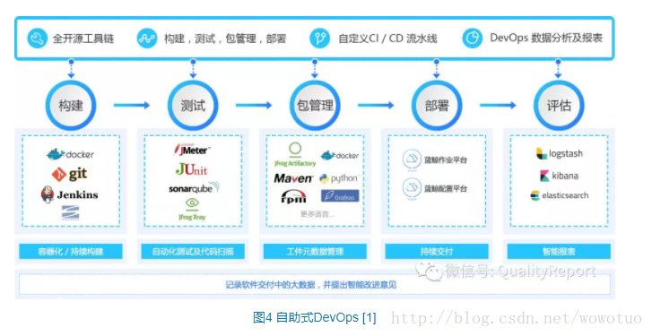

[TOC]
| Time       | TODO               |
| ---------- | ------------------ |
| 2019.08.09 | 完成devops导论课程 |

# DevOps导论

## 第一讲： DevOps 概述 
介绍基本概念和软件过程演变历史，引出DevOps的必要性。

### 1.DevOps 是什么？

**DevOps是一种方法论，是一系列可以帮助开发者和运维人员在实现各自目标（Goal）的前提下，向自己的客户或用户交付最大化价值及最高质量成果的基本原则和实践。**
DevOps所关注的不是工具本身，也不是对chef或Docker的掌握程度。

开发者和运维人员之间最大的问题在于：虽然都是企业中大型IT部门不可或缺的，但他们有着截然不同的**目的（Objective）**。

### DevOps 关键
#### 1、人员

实施 DevOps 时，开发团队、IT运营团队、质量工程团队和安全团队密切合作，打破以往孤立的做法。
各专业团队之间的协调和协作得到改善，缩短了将更改提交到系统与将更改投入到生产之间的时间。

另一个有趣的变化是团队的座位，功能团队有了特有的办公区域，这里大家可以随意坐，但是这个区域内所有工作相关的对话都要是和每个人相关的。在这里还可以开会，以及长期的谈话和电话。这是开放计划和办公室的完美结合。
####  2、流程

##### 规划和跟踪
使用做法和进程（如看板DashBoard和敏捷）来识别和跟踪工作。直观地跟踪工作时，利益干系人可清楚地了解开发团队的能力，并更好地规划任务并设置优先级，避免发生紧急情况。

##### 开发
使用 Git 等新式版本控制系统编写代码，将其持续安全地集成到主分支。某项功能完成后，开发人员会提交一个拉取请求，得到批准后，更改将合并到主分支，而旧分支将被删除。

##### 生成和测试
将代码签入 Git 或其他版本控制系统可启动自动生成过程。该代码经过测试和验证，确保在开发初期发现 bug，此时开发人员对这些 bug 的印象还不深，修复成本低。这一自动执行生成和测试的过程称为持续集成 (CI)。生产可部署项目是成功生成和集成的结果，可实现持续交付 (CD)，即随时部署到生产的功能。

##### 部署
经过测试和验证后，可将每项更改部署到生产环境中。通过使用持续交付做法，最终部署到生产是一个手动控制的业务决策。

通过持续部署，可自动执行从代码提交到生产的全过程。自动部署代码时，客户准备就绪后便可使用新功能。

##### 监视和运营
投入生产后，监视提供有关应用性能和使用模式的信息。通过获取团队可快速处理的丰富的即时诊断数据，实现高可用性。缓解用户问题并收集数据，为未来开发的业务决策提供信息。借助使用“基础结构即代码”和“策略即代码”的自动化符合性策略，确保部署到生产的应用使用符合安全最佳做法的所需状态配置。

#### 3、技术

开发通过工具驱动所有流程运转向前走

### DevOps 的承诺
DevOps 自动执行并加速软件交付。它使流程和产品更可靠。实施 DevOps 技术和做法时，可通过创新产品或增强现有产品，更快地为客户提供价值。

## 第二讲： PSP专题 
介绍一种个体的软件开发过程（Personal Software Process，PSP）[^1]

## 第三讲： 敏捷专题 
介绍敏捷方法，建立DevOps的方法学基础

### 持续开发
开发->版本控制->代码检查->构建->自动化测试->打包

### 持续部署

打包->远程仓库发布->SIT部署

## 第四讲： 软件架构演化 
介绍微服务架构演化的历史和动机

SOA （面向服务的架构） 编辑
面向服务的架构（SOA）是一个组件模型，它将应用程序的不同功能单元（称为服务）进行拆分，并通过这些服务之间定义良好的接口和契约联系起来。接口是采用中立的方式进行定义的，它应该独立于实现服务的硬件平台、操作系统和编程语言。这使得构建在各种各样的系统中的服务可以以一种统一和通用的方式进行交互。

## 第五讲： 容器技术与云原生  

### 5.1 虚拟化技术
虚拟化技术详细见虚拟化专题wiki[^3]

### 5.2 云原生概念
云原生 Cloud Native Landscape
CNCF，即云原生计算基金会

## 第六讲： XaaS与服务标准 

介绍一切皆服务理念以及常用的服务质量标准和模型

### 6.1 XaaS
　　XaaS，即一切皆服务，代表 “X as a service”、“anything as a service”或“everything as a service” 。这一缩写指越来越多地通过互联网提供的服务，而不仅仅指本地或现场服务。云计算的本质就是XaaS。[^2]

**经典服务**
1. Software as a Service（SaaS）
软件即服务，软件分发方式，中心化，服务供用户订阅
2. Infrastructure as a Service（laaS）
基础设施及服务，虚拟化，用户需要配置和部署中间件和应用服务
3. Platform as a service（PaaS）
平台即服务，服务供应商提供开发的整体环境.

### 6.2 服务标准 

DevOps中“Ops”端最常见的形式就是以各种服务的方式提供给用户，因此，需要遵循一定的标准和要求.
常见服务标准有

#### 1.CMMI-SVC

#### 2.ITIL
   
#### 3.ISO20000

·ISO20000是国际标准化组织发布的第一部针对信息技术服务管理（IT Service Management）领域的国际标准
·ISO20000定义了“策划-实施-检查-处置”（PDCA）方法论应用于服务管理体系（SMS）和服务的所有部分：
P-策划：建立书面和协定的服务管理体系；服务管理体系
D-实施：实施和运行服务管理体系，以设计、转换、交付和 改进服务；
C.检查：根据方针、目标、计划和服务需求，对服务管理体实施℃处置系进行监视、测量和回顾，并报告结果；
A-处置：采取措施，以持续改进服务管理体系和服务的绩效。

#### 4.ITSS

## 第七讲： DevOps工具链  

DevOps实际是一种文化上的变迁，代表了开发、运维、测试等环节之间的协作，因此DevOps工具是非常多种多样的，甚至可以由多种工具组成一个完整的DevOps工具链。此类工具可以应用于一种或多种类别，并可体现出软件开发和交付过程的不同阶段：

编码：代码开发和审阅，版本控制工具、代码合并工具
构建：持续集成工具、构建状态统计工具
测试：通过测试和结果确定绩效的工具
打包：成品仓库、应用程序部署前暂存
发布：变更管理、发布审批、发布自动化
配置：基础架构配置和部署，基础架构即代码工具
监视：应用程序性能监视、最终用户体验

介绍DevOps工具链的选择和搭建

### 1. 编码
代码开发和审阅，版本控制工具、代码合并工具

#### 代码开发和审阅
VScode 
| 工具  | 描述     |
| ----- | -------- |
| JIRA  | 协同开发 |
| Rally | 协同开发 |

#### 版本控制工具、代码合并工具
| 工具              | 描述         |
| ----------------- | ------------ |
| Git/github/gitlab | 版本控制工具 |

### 2.构建：
持续集成工具、构建状态统计工具
 Ant, Maven, Grunt, Gradle, Make, MSBuild, Cmake

| 工具     | 描述                                                       |
| -------- | ---------------------------------------------------------- |
| Jenkins  | 持续集成，自动化编译，自动化测试，自动化部署，丰富的插件库 |
| Bamboo   | 持续集成                                                   |
| TeamCity | 持续集成                                                   |

Ant, Maven, Grunt, Gradle, Make, MSBuild, Cmake

Jenkins, TeamCity, Visual Studio, CodeShip, Bamboo

Jenkins（）

### 3.测试：

软件开发中的完成测试环境所包括的环节包括：UT、IT、ST、UAT 
UT = Unit Test 单元测试 
IT = System Integration Test 集成测试 
ST = System Test 系统测试 
UAT = User Acceptance Test 用户接受测试(俗称:验收测试)

Vagrant（虚拟化平台）

通过测试和结果确定绩效的工具

Selenium, Cucumber, Jasmine, Jmeter, Junit
打包：成品仓库、应用程序部署前暂存
## 发布：

变更管理、发布审批、发布自动化
 CodeDeploy, Otto, SmartFrog, RapidDeploy

### 发布管理

Docker, Nomad

## 配置：

Puppet（基础架构构建）
基础架构配置和部署，基础架构即代码工具
## 监视：

应用程序性能监视、最终用户体验

| 工具   | 描述                     |
| ------ | ------------------------ |
| Nagios | 监控系统、网络和基础架构 |

Nagios用于监控系统、网络和基础架构，提供监控功能的同时还能发出警报，当监控的系统出现异常情况，Nagios可以迅速发出警报，帮助运维团队发现问题。Nagios安装在Linux平台，可以实现以下功能：
1.网络服务（SMTP、POP3、HTTP、PING等）
2.主机的资源（进程负载、硬盘使用情况等）
3.检查并行的服务
4.使用父节点的方式侦测网络中的子节点是否连接正常
5.当节点或服务出现异常，生成通知（邮件、报告或客户定义的方式）功能
6.自动的日志记录

Build:  
Testing:    Selenium, Cucumber, Jasmine, Jmeter, Junit
CI: Jenkins, TeamCity, Visual Studio, CodeShip, Bamboo
Deployment: CodeDeploy, Otto, SmartFrog, RapidDeploy
SCM:    SubVersion, Git, GitHub, BitBucket
Collaboration:  TFS, Trello, Jira, Slack
Release Mgmt    Docker, Nomad

2.1 部署流水线的定义

大神 Jez Humble 对部署流水线的定义：部署流水线是指软件从版本控制库到用户手中这一过程的自动化表现形式。对软件的每次变更都会经历一个复杂流程才能发布。

另一位大神 Martin Fowler 认为部署流水线是持续交付的核心环节。

导读：

实施DevOps最佳实践的公司证明，它们在实现和设计IT工具和实践方面更加高效灵活，从而以更低的成本产生更高的收入。对于希望接受比特币等新发明的传统组织来说，采用DevOps工具提供了一致性、质量和效率。

开源DevOps工具被用来简化开发和部署过程。使用开源软件的好处是，它是通过增强的协作构建的，可以驱动创新，并增强处理市场和需求转变的灵活性。对代码的可见性有助于提高整体质量和安全性，并帮助公司防止厂商锁定专有供应商。

如果你希望加快已有应用，或刚刚开始使用DevOps，下面是11款开源DevOps工具值得考虑。

Behat
Behat是一个用于自动测试业务所期望的PHP框架。它是一个行为驱动的PHP开源开发框架。该工具支持通过测试自动化，故意发现和持续通信提供重要的软件。

Watir
Watir是一款Web应用程序跨平台开源测试工具。它是用于自动化Web浏览器的Ruby库的最灵活可靠的工具。像人一样，这个工具与浏览器通信，以便验证文本，填写表单并单击链接。

Supergiant
Supergiant建立在Kubernetes之上，是一个用于容器管理的开源平台。它被用于Kubernetes在几分钟内部署在多个云上。SupergiantAPI用于简化生产部署。 借助Supergiant的打包算法，可以降低硬件成本，并且只需使用计算效率所需的硬件。

Ansible

Ansible自动执行与IT操作相关的各种常见任务，例如应用程序部署，配置管理和云配置。 它由Red Hat拥有。集成了许多其他著名的DevOps工具，包括Jenkins，JIRA，Git和其他许多工具。在GitHub上可以找到免费的开源版本。红帽提供三种付费版本 - 高级，标准和自助 - 价格根据所需的支持级别和生产节点数量而不同。

Nagios
基础设施监控是一个有众多解决方案的领域，从Zabbix到Nagios到各种其他开源工具。尽管目前市场上有很多新的工具，Nagios是一个完善的监控解决方案，由于大量的贡献者社区为其创建插件，它非常高效。Nagios有能力在不同的可视化报告和展示中提供结果。

SaltStack
SaltStack是Salt的付费企业版本。Salt是用于事件驱动编排，云控制，配置自动化和远程执行的高度灵活，功能强大且智能的开源软件。 它帮助DevOps公司编排有效的代码生产流程，并保持复杂的基础架构调整为最佳应用交付和业务服务。 Saltstack协调DevOps的价值链，帮助部署和配置动态应用程序。

Chef
Chef可以使用单一工具管理传统和云环境。在保持高可用性的同时，Chef承诺加速云的采用。Chef开发工具包提供开发所需的工具，并在将变更部署到生产环境之前，在本地测试来自工作站的基础设施自动化代码。在Chef站点上，提供了许多技术资源和大量文档，其中包括旨在帮助组织过渡到DevOps并扩展其DevOps实现的各种资源。

Docker
Docker的可移植性正在改变IT环境。可移植性通过其特殊的容器化技术实现的，这种技术经常在独立的设备中发现。它包了一个应用程序需要运行所需要的一切东西:库、系统工具、运行时等等。由于这个原因，应用程序可以以相同的方式运行，而不考虑它们的部署位置。被称为Docker Engine的是负责创建和运行Docker容器的工具。Docker Hub是基于云的服务应用程序，它包含了应用程序共享和工作流自动化的概念。

Git
近年来，Git在管理源代码方面非常流行。它已经成为著名的用于托管开放源码项目的站点。由于处理合并和分支的方便性，从其他版本控制管理中脱颖而出。许多DevOps团队利用它来管理应用程序的源代码。它具有强大的拉请求和分叉特性。还包括与Jenkins链接的插件，以促进部署和集成。

Hudson
Hudson是一个管理和监控持续测试和集成的工具。Hudson的关键特性包括对各种系统的支持，包括源代码管理、应用服务器、代码分析工具、测试框架、构建工具、测试失败的实时通知、变更集支持，以及易于安装和配置的过程。一个巨大的插件库可以进一步扩展它的功能。

Puppet
不管它在哪里运行，Puppet都承诺了一种标准的操作和交付软件的方式。Puppet可以自动部署，以提高可审核性、可靠性和敏捷性。Puppet的产品在完整的软件交付生命周期中提供持续的自动化和交付。最新版本的Puppet提供了节点管理器和Puppet应用程序，可帮助处理大量动态的可变的系统。

结论

DevOps的世界充满了独特而优秀的开源工具。与以前相比，上述流行的DevOps工具可以有效地弥合开发和生产环境之间的差距。企业可以选择适合业务需求的工具，并且可以立即看到业务运营中的差异。而且，这些不同的DevOps工具不仅可以单独运行，还可以很好地协同工作。

原文链接：

11 Popular Open Source DevOpsTools Worth Knowing

## 参考资料
[^1]:https://wiki.mbalib.com/wiki/%E4%B8%AA%E4%BD%93%E8%BD%AF%E4%BB%B6%E8%BF%87%E7%A8%8B
[^2]:http://wiki.mbalib.com/wiki/XaaS
[^3]:[]